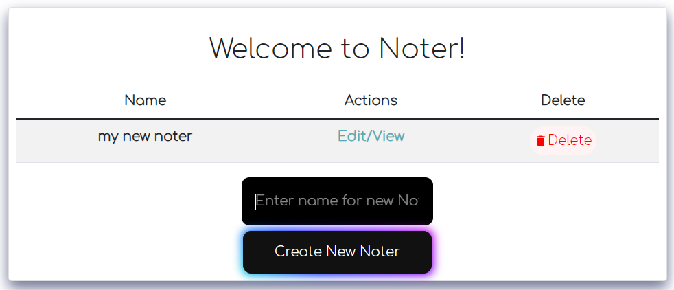
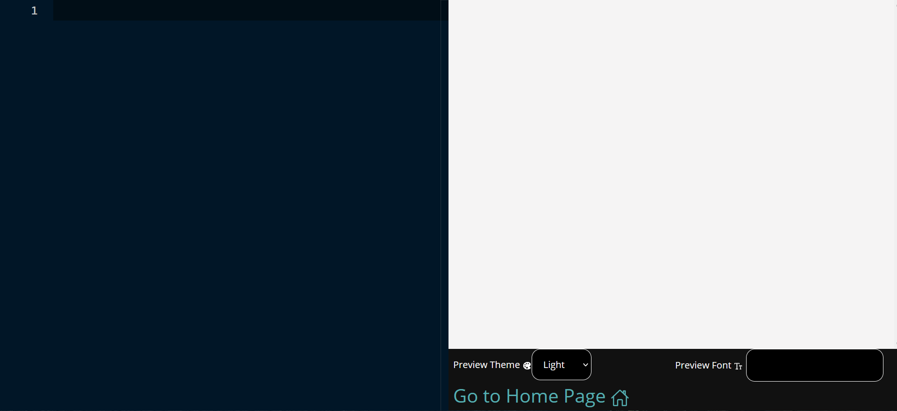
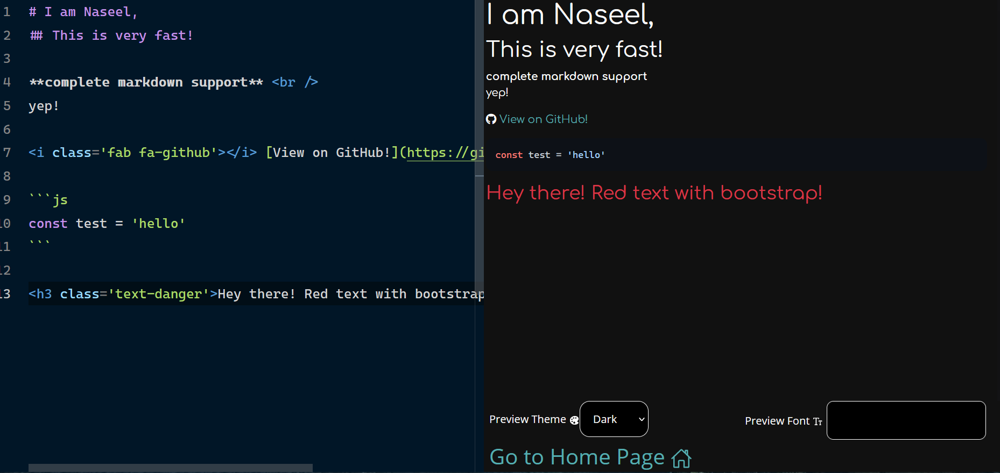

<h1 align='center'>
Noter  

</h1>

# Use noter right now! > <a href='https://noter-pi.vercel.app/'>Noter</a>

## Save notes in your browser!

Fully featured text editor and customizable preview 😮

Very rapid UI update to show the preview ⚡

